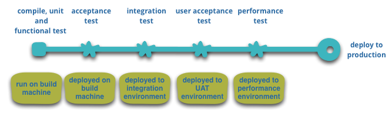

# 微服务

整体架构


局部服务架构


微服务的设计目的是为了让大型软件系统解耦。将不同职责的服务独立部署，从而实现服务内部高内聚，服务之间低耦合的效果，让开发变得更为灵活。当然“分开是为了更好的在一起”，为了重新组合和稳定运行这些服务，人们发明了服务发现、熔断机制、服务部署监控等一篮子工具。

介绍微服务的文章和书箱已经很多了，这里就不再对此阐述过多。这里链接到 Martin Fowler的文章《Microservices》

原文：https://martinfowler.com/articles/microservices.html 

翻译：https://www.cnblogs.com/liuning8023/p/4493156.html


微服务架构是一种架构模式，它提倡将单一应用程序划分成一组小的服务，每个服务运行在其独立的进程中，服务间采用轻量级通信机制互相沟通（通常是基于HTTP协议的RESTful API）。每个服务都围绕着具体的业务进行构建，并且能够被独立部署到生产环境、预生产环境。

## 微服务的好处

- 每个服务可以独立开发
- 处理的单元粒度更细
- 单个服务支持独立部署和发布
- 更有利于业务的扩展

## 微服务的问题

独立开发导致技术上的分离，HTTP通信加上Queue的机制增加了问题诊断的复杂度，对系统的功能、性能和安全方面的质量保障带来了很大的挑战。另外，服务间的复杂依赖关系带来了很多的不确定性，要实现独立部署，对运维也提出了更高的要求。微服务架构的系统要特别关注这几个方面：

- 服务间的依赖、连通性
- 服务的容错、可用性
- 数据的最终一致性
- 独立部署
- 复杂依赖关系带来的不确定性


# Akka微服务


## 分散数据管理

微服务让每个服务管理自己的数据库：无论是相同数据库的不同实例，或者是不同的数据库系统。


## 基础设施自动化

基本的构建流程



模块化部署的区别


## 微服务-服务发现


服务发现，作为微服务治理方面非常重要的一环，它是微服务的一个核心组件。通常大部分服务发现工具还带有健康检查等功能，比如：**Nacos**。

### [Akka Discovery](https://doc.akka.io/docs/akka/current/discovery/index.html)

Akka Discovery是Akka团队专为Akka生态开发的服务发现接口（提供了统一的服务发现API，但并不实现具体的服务发现功能），支持：DNS、静态配置、Console、k8s等服务发现功能。Akka Discovery本身不带健康检查功能，由下层具体实现提供，同时，Akka Discovery设计为可扩展的，我们可以很容易的扩展它支持更多的服务发现框架。

### [Nacos](https://nacos.io/zh-cn/docs/architecture.html)

Nacos是阿里巴巴开源的一套使用Java语言编写的服务注册、服务发现框架，它提供了HTTP API、Java SDK等易用的集成方式，可单独使用，也集成到Spring Cloud里使用。Akka Discovery因其设计上强大的可扩展性，我们可以将其与Nacos集成。同时，对于已使用了Spring Cloud的团队来说，Akka服务也需要与已存在的Spring Cloud进行集成，而通过Akka Discovery -> Nacos -> Spring Cloud的形式集成两者是非常吸引人的。

#### 动态配置服务

#### 服务发现及管理


## 服务间通信

微服务架构中，服务间通信最常用的就是基于HTTP RESTful来实现，同时也有很多采用RPC的方式，比如：gRPC、Thrift、Dubbo等。

### 服务协议

#### RESTful（Akka HTTP）

微服务发布的API，需要由某个协议来承载，最常用的就是基于HTTP协议的RESTful风格的形式了。Akka HTTP提供了丰富的HTTP特性，支持HTTP 1.0、1.1、2.0。

Akka HTTP提供了 **Routing DSL**（https://doc.akka.io/docs/akka-http/current/routing-dsl/index.html）高级API来定义服务接口。

#### gRPC（HTTP 2）

gRPC使用Protobuf进行数据序列化，基于HTTP 2提供RPC通信。具有快速、高效、易用、可扩展等特点。采用HTTP 2作为底层协议，可以更好的与已有的HTTP基础服务整合，简化了运维管理（不需要为了RPC单独开放网络端口，并对其进行管理）。gRPC支持请求/响应和Stream两种接口形式，可以实现服务端推送功能。

Akka提供了开箱即用的akka-grpc

[Akka gRPC](https://doc.akka.io/docs/akka-grpc/current/)

[这篇文章详细的说明了为什么需要gRPC，特别是gRPC与REST、SOAP、Message](https://doc.akka.io/docs/akka-grpc/current/whygrpc.html)

### 序列化

服务API发布后，需要有一个序列化格式来说明API暴露的数据是怎样组成的，这就是数据的序列化。数据序列化通常是成对的，服务提供方编码（Marshal）数据，而服务消费方则解码（Unmarshal）数据。

#### JSON

JSON（JavaScript Object Notation，https://json.org/）是现在最常使用的服务间序列化方式，具有简单、简单、简单的特点。但使用JSON也有如下不足：

1. 数据类型不够丰富；
2. 没有类型静态约束；
3. 文件传输，相比二进制数据还是偏大。

#### Protobuf

Protobuf是Google开发的一款二进制序列化工具，类似的还有Thrift、Flatbuf（速度比Protobuf更快，但二进制数据更大，相应网络传输占用会更多）、Dubbo（Dubbo可支持的语言现在还比较少，移动端支持也很弱）等，它相对JSON具有以下优点：

1. 更丰富的数据类型；
2. 静态类型约束；
3. 有Shema描述文件，可自动生成数据类；
4. 二进制传输，更省带宽。

### 使用Akka Discovery + Akka gRPC构建微服务集群

Akka gRPC提供了对Akka Discovery的支持，Akka gRPC客户端可通过Akka Discovery来发现服务。

让我们来看一个服务发现配置的例子：

##### 服务方

```protobuf
message HelloRequest {
    string name = 1;
}

message HelloReply {
    string message = 1;
}

service GreeterService {
    rpc SayHello (HelloRequest) returns (HelloReply) {}

    rpc ItKeepsTalking (stream HelloRequest) returns (HelloReply) {}

    rpc ItKeepsReplying (HelloRequest) returns (stream HelloReply) {}

    rpc StreamHellos (stream HelloRequest) returns (stream HelloReply) {}
}
```

`GreeterService`描述了一个gRPC服务定义，接受`HelloRequest`并响应`HelloReply`。**sbt-akka-grpc** 插件提供了自动化构建gRPC的sbt插件，你可以如下使用：

```sbt
addSbtPlugin("com.lightbend.sbt" % "sbt-javaagent" % "0.1.5")
```

##### 调用方

```properties
  akka.grpc.client {
    "sample.HelloService" {
      service-discovery {
        mechanism = "nacos"
        service-name = "sample-hello"
      }
      use-tls = false
    }
    # 可配置更多服务（endpoint）发现
}
```

Endpoint：`sample.HelloService`是gRPC服务的全限定路径，每个Endpoint都需要有一个配置（**注意：服务路径需要用双引号括起来，不然Typesafe Config会认为这个配置分割符**）。在`service-discovery`配置内指定服务发现机制和服务名，而`use-tls`设置为**false**可以关闭https，对于内网服务之前的调用来说是可行的，它可以减少些流量。但若你的服务需要暴露到公网，强烈建议设置为**true**（默认值）。可以通过如下代码构造一个提供了服务发现支持的gRPC客户端：

```scala
val settings = GrpcClientSettings.fromConfig(clientName = "sample.HelloService")
val client = HelloServiceClient(settings)
```

更详细的demo可以参考https://github.com/las-asdx/scala_ci/tree/akka-grpc

# 微服务拆分

领域驱动设计（DDD）的普及和应用让微服务拆分和落地有了理论的指导，有章可循，有法可依。特别是在一个产品或者项目开发的初期，可以很自然的通过DDD的知识帮助进行微服务的划分，指导架构设计。

采用 DDD 来进行业务建模和服务拆分时，可以参考下面几个阶段：

1. 使用 DDD（领域驱动建模） 进行业务建模，从业务中获取抽象的模型（例如订单、用户），根据模型的关系进行划分限界上下文。

2. 检验模型是否得到合适的的抽象，并能反映系统设计和响应业务变化。

3. 从 DDD 的限界上下文往微服务转化，并得到系统架构、API列表、集成方式等产出。

   

**使用DDD划分微服务的过程**


## 使用DDD进行业务建模

**利用事件刺探业务黑盒并抽象出模型**


